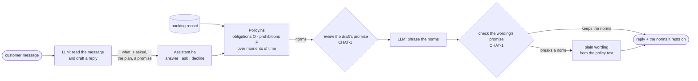

# Case study: an airline assistant that cannot be talked into a refund

**Read this after [Minds L1](../L1-novice/minds.md).** That page teaches deontic logic (what ought to be)
and temporal logic (what holds over time) on small examples. This case study uses both on a real
problem: a customer-service chatbot that must never promise what the company's written policy does not
give.

**Source:** [`src/MLambda.AI.Airline/`](../../src/MLambda.AI.Airline/)

## The problem

In 2022 Air Canada's website chatbot told a grieving customer, Jake Moffatt, that he could fly at full
price and claim the bereavement discount back within 90 days. The written policy said the opposite. In
*Moffatt v. Air Canada* (2024 BCCRT 149) the tribunal held the airline to what its chatbot said: a chatbot
"is still just a part of Air Canada's website", and the company is responsible for all of it. The full
story, and why a better prompt does not fix it, is on the Ideas page
[When a chatbot makes a promise](../ideas/semantics-and-accountability.md).

The ruling puts responsibility where it belongs. There are two reasons that matters:

- **A language model has no cognition of the policy.** It produces the most plausible continuation of
  the conversation. "You can claim it back within 90 days" is plausible and wrong, and nothing inside the
  model tells the difference.
- **People read cognition into it anyway.** This is one of the best-documented biases in psychology.
  In 1966 Joseph Weizenbaum watched users confide in ELIZA, a pattern-matching script, as if it understood
  them. Today this is called the *ELIZA effect*. Epley, Waytz and Cacioppo (2007) showed that people
  readily **anthropomorphise** anything that behaves in human-like ways. Studies of *automation bias*
  (Skitka, Mosier and Burdick 1999; Parasuraman and Manzey 2010) show that people follow a confident
  automated answer even when they have evidence it is wrong. A fluent, polite chatbot triggers all
  three.

So the customer trusts the bot as if it understood the policy, and the bot does not understand the policy.
Somebody has to carry that gap, and the tribunal said it is the company. **A company that deploys a
chatbot therefore needs a way to guarantee what the chatbot may commit it to.** This case study builds
that guarantee out of logic.

## The idea: the model talks, the logic commits

The assistant uses a language model (DeepSeek) for what it is good at: reading a customer's words and
writing a kind reply. Everything that commits the airline is decided by **logical statements** in
[`Policy.hs`](../../src/MLambda.AI.Airline/Policy.hs). This is the neuro-symbolic pattern from the
Ideas page [Neuro-symbolic AI](../ideas/neuro-symbolic.md): a network that proposes, and a logic that
checks.



Three kinds of logic make it work, and each has a page:

| Logic | What it adds | Page |
|---|---|---|
| **Deontic**: obligation `O`, prohibition `F`, permission | every policy becomes a norm with a source, and the bot's promises are acts that can be forbidden | [rules.md](rules.md) |
| **Temporal**: moments, *until*, *never* | a norm depends on *when* the customer would ask, which is exactly the Moffatt mistake | [time.md](time.md) |
| **Agent (BDI)**: intend, impossible | the kind of reply — answer, ask for a booking, decline — is chosen before any words are written | [rules.md](rules.md#the-agent-choosing-the-kind-of-reply) |

## Watch someone try to hack it

The video below is a real session. The customer tries to get a refund they are not owed by asking the
same question in different ways: fly first and claim later, claim while sitting on the plane, claim "one
minute before". [hacking.md](hacking.md) goes through it turn by turn: what the model read, what the
logic derived, what held, and the two places where the answer was safe but not right.

<video controls preload="metadata" style="width: 100%; border-radius: 8px;">
  <source src="../assets/videos/hacking-the-bot.mp4" type="video/mp4">
</video>

If the player does not load, [download the video](../assets/videos/hacking-the-bot.mp4).

## The pages

- [rules.md](rules.md): the policies as obligations and prohibitions, the rule the Moffatt chatbot
  lacked, and what the kernel proves
- [time.md](time.md): **use case**, adding temporal logic after a customer asked "can I fly and then get
  a refund?"
- [hacking.md](hacking.md): the session in the video, turn by turn
- [writing-rules.md](writing-rules.md): how to write logical statements that a tricky question cannot
  bend, with an exercise

## Run it

```bash
# a DeepSeek API key, read from the environment and never stored
setx LLM-API "sk-..."            # Windows; or export LLM_API=sk-... in bash

dotnet run --project src/MLambda.AI.Airline
dotnet test test/MLambda.AI.Airline.Tests    # uses a fake model, no key needed
```

The address prompts go to is a constant in
[`DeepSeek.cs`](../../src/MLambda.AI.Airline/Llm/DeepSeek.cs); nothing reads it from configuration.

**The policies are modelled, not quoted.** They are simplified from the bereavement policy as the tribunal
describes it and from common refund rules. They are not Air Canada's tariff.

## Sources

- *Moffatt v. Air Canada*, 2024 BCCRT 149
  ([CanLII](https://www.canlii.org/en/bc/bccrt/doc/2024/2024bccrt149/2024bccrt149.html)).
- Weizenbaum, J. (1966). ELIZA — a computer program for the study of natural language communication
  between man and machine. *Communications of the ACM* 9(1), 36–45.
- Epley, N., Waytz, A., & Cacioppo, J. T. (2007). On seeing human: a three-factor theory of
  anthropomorphism. *Psychological Review* 114(4), 864–886.
- Skitka, L. J., Mosier, K. L., & Burdick, M. (1999). Does automation bias decision-making?
  *International Journal of Human-Computer Studies* 51(5), 991–1006.
- Parasuraman, R., & Manzey, D. H. (2010). Complacency and bias in human use of automation: an attentional
  integration. *Human Factors* 52(3), 381–410.
