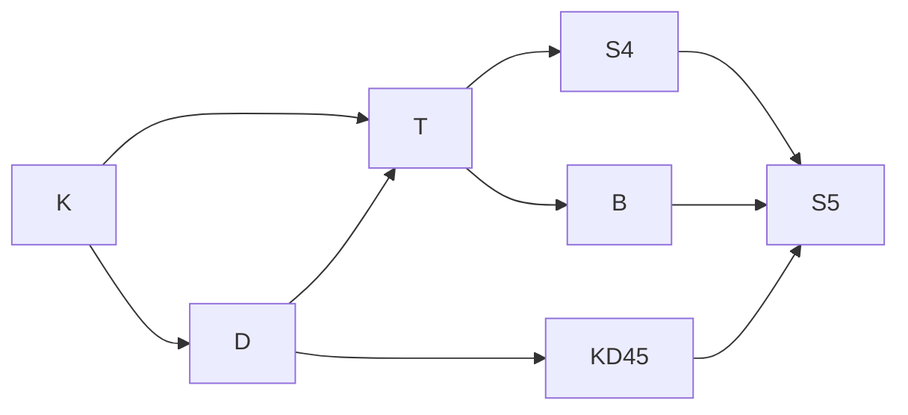

# The modal systems, explained

**K, T, D, S4, S5, KD45** read like model numbers. They are names for a small number of **choices**
about what an attitude is allowed to do: can it be wrong, does it see itself, can it be empty. Once
you know the six choices, every system is just a list of the ones you made.

This page explains the choices first, then the systems, and then how to pick one for a real problem.
If you haven't read [Putting a thought into a machine](thinking-machines.md), start there; it explains
why possible worlds are the right picture.

---

## Two operators and a relation

Every modal logic here has one pair of operators:

| symbol | read as | means |
|---|---|---|
| **□p** | "necessarily p" | p holds in **every** accessible world |
| **◇p** | "possibly p" | p holds in **some** accessible world (◇p is ¬□¬p) |

The **word** changes with the attitude; the mathematics doesn't.

| attitude | □p is read | ◇p is read | the accessible worlds are |
|---|---|---|---|
| knowledge | *i knows p* (Kᵢp) | *p is consistent with what i knows* | worlds i cannot rule out |
| belief | *i believes p* (Bᵢp) | *i doesn't rule p out* | worlds i takes to be actual |
| obligation | *p is obligatory* (Op) | *p is permitted* (Pp) | ideal worlds, where every duty is met |
| time | *always p from now* (Gp) | *eventually p* (Fp) | now and every later moment |
| desire | *i wants p* (Dᵢp) | *p is compatible with what i wants* | worlds where i's wishes are fulfilled |

A **frame** is a set of worlds plus an **accessibility relation** saying which worlds each world
"sees". All the choices below are properties of that relation.

---

## What a world is: an afternoon of rain

A **possible world**, in Kripke's semantics, is a complete alternative way reality could be. Not a
place, and not a part of reality: a whole version of everything.

You are at home, and the curtains are closed. It might be raining outside, or it might not. So, for
you, two worlds are still open:

| world | you are | outside |
|---|---|---|
| **w_rain** | at home, curtains closed | it is raining |
| **w_dry** | at home, curtains closed | it is dry |

Both are the whole world, and you are inside the house in both. They differ only in what you can't
see. One of them is the **actual** world, the one you are really in. The other is an alternative
you have not ruled out.

### Knowing

> **You know p when p is true in every world you cannot rule out.**

With the curtains closed you can't rule out either world. Rain holds in one and not the other, so
**you don't know it is raining**, and you don't know it is dry either.

Open the curtains. Now the world where it's dry (say it's actually raining) is ruled out. Only
`w_rain` is left, rain holds in it, and **you know it is raining**.

Because knowledge is **S5**, it has **T**: the actual world is always among the worlds you can't rule
out, since you can't rule out where you really are. So whatever you know is true. You can't *know*
it's raining on a dry afternoon.

### Believing

You hear a drumming on the roof and think *rain*. You haven't looked. Your **belief** settles on the
worlds you take to be how things are: only `w_rain`.

> **You believe p when p is true in every world you take to be actual.**

Rain holds in `w_rain`, so **you believe it is raining**. Now suppose the drumming was a neighbour's
washing machine, and the actual world is `w_dry`:

| | worlds considered | raining in all of them? | verdict |
|---|---|---|---|
| **knowledge** | `w_rain`, `w_dry` (you haven't looked) | no | you **don't know** it's raining |
| **belief** | `w_rain` (you settled on rain) | yes | you **believe** it's raining |
| **truth** | `w_dry` (the actual world) | no | it **isn't** raining: the belief is false |

That's possible only because belief is **KD45**, which has no T. The actual world, `w_dry`, can be
missing from the worlds you believe in. Knowledge can never leave it out.

This is the beauty of the idea. **One picture, worlds and which ones an attitude takes seriously,
represents a mind that can be wrong, a mind that can't, and the difference between them.** A machine
built on it can hold *"she believes it's raining"* and *"it isn't raining"* at the same time,
without contradiction, and can conclude on its own that her belief is false. That is exactly what
[Minds, L2](../L2-practitioner/minds.md) runs, with a door instead of the weather.

### Four misreadings worth avoiding

1. **"Inside the house is my world; outside is another world."** No. Each world is a *whole*
   alternative: in both worlds you are inside, and outside differs. Worlds don't divide space; they
   divide *possibilities*.
2. **"Knowing means true in all possible worlds."** No. That would be *necessity*, what holds however
   reality had gone, like 2 + 2 = 4. Knowing means true in all worlds **you cannot rule out**, a set
   that shrinks as you learn. And **reality** is not all the worlds. It is **one** of them, the actual
   world.
3. **"In the logic K, beliefs count as knowledge."** No. K is too weak to be knowledge: it has no T, so
   a single operator in K could "know" something false. What separates belief from knowledge isn't K
   versus S5. It's the one axiom **T**, present for knowledge (S5) and absent for belief (KD45).
4. **"You can believe something while knowing it is false."** Not if the logic links the two, as
   [Minds](../L2-practitioner/minds.md) does: every world you believe in is a world you can't rule
   out. If you *know* it's dry, every world you can't rule out is dry, so every world you believe in is
   dry, so you believe it's dry, and D stops you believing rain as well. What *is* possible is that
   **you** believe it's raining, it isn't, and **someone else**, who looked, knows it isn't.

---

## The six choices

### K — distribution (every normal modal logic has it)

> **□(p → q) → (□p → □q)**

If you know that p implies q, and you know p, then you know q. It holds on **every** frame, with no
condition, which is why the weakest system is simply called **K**. It is also the source of *logical
omniscience*: an agent closed under K knows every consequence of what it knows.

### T — truth, or factivity

> **□p → p**  ·  frame condition: **reflexive**, every world sees itself

| reading | T says | keep it? |
|---|---|---|
| knowledge | what is known is true | **yes**: this is what makes knowledge knowledge |
| belief | what is believed is true | **no**: people believe falsehoods |
| obligation | what ought to be, is | **no**: an unpaid debt is still owed |
| time (G) | what always holds from now holds now | **yes**, if "always" includes the present |

T is the single line between an attitude that can be **wrong** and one that can't.

### D — consistency, or seriality

> **□p → ◇p**  ·  frame condition: **serial**, every world sees at least one world

| reading | D says |
|---|---|
| belief | if you believe p, you don't also rule p out; you can't believe p and not p |
| obligation | whatever is obligatory is permitted; a rulebook can't demand p and not p |
| desire / intention | you can't want or intend a contradiction |

Without D, an agent with **no** accessible worlds satisfies □p for every p, so it believes
everything, including a contradiction. That is why D matters: it keeps the attitude from being
vacuous. (T implies D, since a world that sees itself sees something.)

### 4 — positive introspection, or transitivity

> **□p → □□p**  ·  frame condition: **transitive**: if w sees u and u sees v, then w sees v

- knowledge: *if you know p, you know that you know p.*
- belief: *if you believe p, you believe that you believe it.*
- time: *if p holds always from now, then from every later moment p holds always.*

Mostly uncontroversial for idealised agents.

### 5 — negative introspection, or euclideanness

> **¬□p → □¬□p**  ·  frame condition: **euclidean**: if w sees u and w sees v, then u sees v

- knowledge: *if you don't know p, you know that you don't know p.*

This is the axiom people argue about. Do you really know everything you don't know? A perfectly
self-aware reasoner does. A person who has never heard of a subject doesn't even know there is
something missing. Dropping 5 is how you model that gap.

### B — symmetry

> **p → □◇p**  ·  frame condition: **symmetric**: if w sees u, then u sees w

If p is true, you know that p is at least possible. Rarely chosen on its own, but it **follows** from
T and 5 together. That's a real theorem, proved in this repository as `knowledge_is_symmetric`.

---

## The systems are lists of choices

| system | axioms | frame | the usual reading | in this repository |
|---|---|---|---|---|
| **K** | K | any | the weakest normal logic: consequence only | — |
| **T** (also M) | K, T | reflexive | factive attitude, no introspection | — |
| **D** | K, D | serial | consistent attitude | — |
| **KD** | K, D | serial | **standard deontic logic**: obligation | [`Duty.hs`](../../src/MLambda.AI.Minds/Duty.hs) |
| **S4** | K, T, 4 | reflexive, transitive | knowledge **without** negative introspection; also "always" over branching time | [`Worlds.hp`](../../src/MLambda.AI.Logic/Worlds.hp) with only `refl, trans` |
| **B** | K, T, B | reflexive, symmetric | the "Brouwer" system | — |
| **S5** | K, T, 5 (so 4 and B follow) | an equivalence relation | **idealised knowledge** | [`Knowledge.hs`](../../src/MLambda.AI.Minds/Knowledge.hs), [`Mind.hs`](../../src/MLambda.AI.Minds/Mind.hs) |
| **KD45** | K, D, 4, 5 | serial, transitive, euclidean | **belief** | [`Knowledge.hs`](../../src/MLambda.AI.Minds/Knowledge.hs), [`Agency.hs`](../../src/MLambda.AI.Agent/Agency.hs) |
| **S4.3** | S4 + connectedness | a linear order | "always" and "eventually" over **linear time** | [`Traffic.hs`](../../src/MLambda.AI.Minds/Traffic.hs) |

How they contain each other (an arrow means *everything provable on the left is provable on the
right*):

Two things to read off that picture:

- **S5 contains KD45.** Add T to belief and you get knowledge. The only difference between knowing
  and believing is T.
- **S5 contains S4 and B without being given either.** From T and 5 alone, 4 and B are theorems.

---

## Beyond one operator

| addition | what it adds | example |
|---|---|---|
| **several agents** | a Kᵢ and Bᵢ per agent, each with its own relation | *alice believes bob knows p*, from [Minds, L2](../L2-practitioner/minds.md) |
| **everyone knows (E)** | p holds for every agent's Kᵢ | a rule posted where every employee saw it |
| **common knowledge (C)** | everyone knows p, everyone knows everyone knows p, and so on forever | the difference between a rule each person read privately and a rule announced to everyone together; famously, two generals who can only send unreliable messengers can never reach it |
| **until (U)** | a binary temporal operator, *p holds until q does* | [`Traffic.hs`](../../src/MLambda.AI.Minds/Traffic.hs): red until green |
| **mixed attitudes** | laws linking relations: knowledge ⇒ belief, desire ⇒ intention | [`Mind.hs`](../../src/MLambda.AI.Minds/Mind.hs), [`Agency.hs`](../../src/MLambda.AI.Agent/Agency.hs) |

---

## How to choose, for a real problem

Ask these questions in order. Each answer adds or removes one axiom.

1. **Can the attitude be wrong?** If a customer can *believe* something false, no T. If the system
   must only act on what is *known*, T.
2. **Can it be contradictory?** A rulebook, a belief set or a plan must be consistent: D.
3. **Does the agent see its own state?** If a system reports what it knows, it should know that it
   knows: 4.
4. **Does it know its own gaps?** Only if it has a complete picture of what it could know: 5. For a
   human user, usually not.
5. **Do attitudes constrain each other?** Knowledge implies belief; intention implies desire; an
   obligation must be something the agent can know about. Each is a law linking two relations.
6. **Does time matter?** Deadlines, "eventually", "never again": add a temporal order.

The answers become an `axioms [...]` line in a `.hp` file, and the kernel then refuses any proof that
leans on a choice you did not make. That is the practical value: **the modelling decision is written
down, checked, and visible to the next person who reads it.**

---

## Correspondence: why the frame conditions work

Every axiom above is true on **exactly** the frames with its condition: T on reflexive frames, 4 on
transitive ones, and so on. This is **correspondence theory**, and it's why this repository can state
"knowledge is factive" as `∀ i w, knows(i, w, w)`, a fact about the relation, rather than as the
formula `K p → p`. On the frames where one holds, so does the other.

That lets a rule engine run a modal logic. The engine never evaluates □; it computes the
accessibility relation from laws like `transK` and `euclidK`, and "knows that p" is simply *p in
every related world*.

**Sources.** Brian Chellas, *Modal Logic: An Introduction* (CUP, 1980). Patrick Blackburn, Maarten de
Rijke and Yde Venema, *Modal Logic* (CUP, 2001). Fagin, Halpern, Moses and Vardi, *Reasoning About
Knowledge* (MIT Press, 1995). Amir Pnueli, "The Temporal Logic of Programs" (FOCS, 1977). Paul
McNamara, "Deontic Logic", *Stanford Encyclopedia of Philosophy*.
