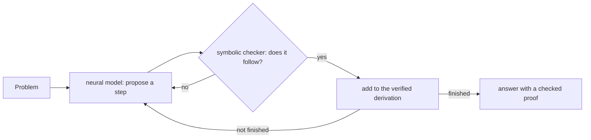

# Neuro-symbolic AI: a network that proposes, a logic that checks

There are two old ways to build an intelligent system, and each is good at what the other is bad at.

| | **neural** (learned) | **symbolic** (reasoned) |
|---|---|---|
| strong at | perception, language, intuition, messy data | exact reasoning, consistency, proof, explanation |
| weak at | guarantees; it can be confidently wrong | reading the world; it needs everything written down |
| an error looks like | a fluent answer that is false | a rule that is missing or wrong, in plain sight |
| you trust it because | it usually works | each conclusion can be checked |

**Neuro-symbolic AI** combines them so each covers the other's weakness. The most striking evidence
that this works comes from mathematics, the hardest place to bluff. This page explains why a chat
model on its own, even one prompted to reason step by step, can't give you what the combination
gives you.

---

## How a language model produces an answer

A large language model is trained to predict the next **token** (a word or piece of a word) given
everything before it. It answers by repeating that step: pick a likely next token, append it, predict
again. Everything it can do comes from how good those predictions are, and they are extraordinarily
good.

But look at what the objective rewards: **text that is likely**, given the text so far. It never
rewards truth directly. Most of the time likely and true coincide, because the training text was
mostly true. When they don't, as with a plausible refund policy that doesn't exist or a citation
that sounds right, the model produces the likely thing with the same fluency. That is what people
call **hallucination**, and it is not an occasional malfunction. It is the objective working as
designed on a question where plausible and true come apart.

---

## Chain-of-thought: reasoning written as text

The standard technique for making models reason better is **chain-of-thought prompting** (Wei et
al., 2022): ask the model to write out intermediate steps ("let's think step by step") before the
answer. Related techniques build on it:

| technique | idea |
|---|---|
| **chain-of-thought** | write the reasoning out before answering |
| **self-consistency** | sample several chains and take the majority answer |
| **prompt chaining** | split a task into prompts, each feeding the next |
| **ReAct** | interleave reasoning steps with tool calls (search, code, APIs) |
| **tree of thoughts** | explore several partial chains and backtrack |

These genuinely improve results, and modern "reasoning" models are trained to do this internally.
But every one of them has the same limit: **the reasoning is still generated text**. Three problems
follow.

1. **Nothing checks a step.** A chain can contain a step that doesn't follow, and the next step
   builds on it just as confidently. There is no referee inside the chain.
2. **Errors compound.** Suppose each step is right 95% of the time. A 20-step argument is then right
   about 0.95²⁰ ≈ **36%** of the time. Long, careful-looking chains are exactly where this bites.
3. **The chain may not be the reason.** Turpin et al. (NeurIPS 2023) showed that chain-of-thought
   explanations can **systematically misrepresent** why a model answered. When a prompt was subtly
   biased toward an answer, models picked it and wrote a plausible rationale that never mentioned the
   bias. A written chain looks like an audit trail without being one.

Self-consistency and tree search reduce the odds of a wrong answer. They don't produce an answer
that is **verified**: a majority of unchecked chains is still unchecked.

---

## The alternative: propose, then verify

Split the work.

- The **neural** part proposes: a candidate step, a construction, a proof tactic, a reading of the
  customer's question. This is guesswork, and it's allowed to be wrong.
- The **symbolic** part checks: does this step follow, under these rules, exactly? If not, it is
  rejected, and the neural part proposes again.

Nothing enters the final answer unless the checker accepted it. So the answer's correctness no longer
depends on the network being right. It depends on the checker, which is small, exact and inspectable.
The network only has to be **useful**: good enough at guessing that the search finishes.

### AlphaGeometry (Google DeepMind, 2024)

Olympiad geometry proofs often need an *auxiliary construction*, a point or line that isn't in the
problem, and finding it is the creative step. AlphaGeometry pairs:

- a **symbolic deduction engine** that derives everything that follows from the diagram by exact
  geometric rules, and
- a **neural language model** that, when deduction gets stuck, proposes a construction to add.

Deduction runs until it stalls, the model suggests a construction, and deduction resumes. On a
benchmark of 30 Olympiad geometry problems it solved **25**, where the previous best system solved
**10** and the average human gold medallist solves **25.9**. The model was trained on **100 million
synthetic examples** that the symbolic engine itself generated and verified. Because every step is a
named geometric rule, its proofs are machine-checkable **and** human-readable.

### AlphaProof (Google DeepMind, 2024)

AlphaProof works in **Lean**, a formal proof language where every proof is checked by a small kernel.
A language model proposes proof steps, and a reinforcement-learning search in the style of AlphaZero
learns which proposals lead to finished proofs. The Lean checker is the ground truth: a proof either
checks or it doesn't.

To get training material, a Gemini model was fine-tuned to translate about **a million** informal
problems into Lean, and AlphaProof trained by proving or disproving millions of them. At the 2024
International Mathematical Olympiad, AlphaProof and AlphaGeometry 2 together solved **4 of 6**
problems for **28 of 42 points**, the level of a silver medallist and one point short of gold.
AlphaProof's three included the competition's hardest problem.

Two honest caveats. For the contest, the problems were **translated into Lean by people**, and some
took the systems up to three days, against the contestants' four and a half hours. And in 2025 an
advanced Gemini model reached a gold-medal standard **in natural language**, without a formal
checker. So pure language models are improving fast. What they still don't give you is a proof a
machine has checked; their solutions were marked by human graders.

### Why the combination is more powerful, not just safer

It's tempting to see the checker as a brake. It is an engine:

- **The checker makes training data.** A verifier can grade millions of attempts without a human.
  AlphaGeometry's 100 million examples and AlphaProof's self-play both depend on that. A chat model
  learning from people's text can't get a signal this clean.
- **Intuition prunes the search.** A symbolic prover alone drowns in possible steps. The network says
  which few are worth trying. Neither finishes Olympiad problems alone.
- **The result can be trusted without trusting the model.** A checked proof is correct however
  it was found. That's what makes a result usable where being wrong has a cost.
- **Mistakes are local.** A rejected step is discarded at once. It doesn't become a false premise
  twenty steps later.

| | chat only | chat + chain-of-thought | neuro-symbolic |
|---|---|---|---|
| handles open-ended language | ✔ | ✔ | ✔ (the neural half) |
| each step checked | ✘ | ✘ | ✔ |
| errors compound over long reasoning | yes | yes | no: rejected steps don't survive |
| explanation is the real reason | not guaranteed | not guaranteed (Turpin et al.) | ✔ the derivation *is* the reason |
| can generate its own verified training data | ✘ | ✘ | ✔ |
| cost | one generation | grows with the length of the chain and the samples taken | **depends on the search space**: see below |
| needs a formal model of the domain | no | no | **yes**, and that is the real work |

**Cost is set by the size of the search, not by the architecture.** A neuro-symbolic system is
expensive when the checker has an enormous space to explore and the model must be consulted again
and again to steer it. Olympiad proofs are that case: AlphaProof trained for weeks on millions of
problems, and some contest problems took days of search. But most practical problems have a
**small** space. Checking a refund answer against a fare policy, a dose against a guideline, or an
agent's action against its permissions is a handful of rule applications: one model call to read the
question, then a derivation that takes milliseconds. That is often **cheaper** than chain-of-thought,
where the model pays in tokens for every reasoning step it writes out, and pays again for each extra
sample taken to vote on the answer.

---

## The same idea in this repository

Hilbert is built on this split, at a smaller scale.

- **In the prover.** `linarith` is an untrusted **sage**: it searches for a certificate (a
  combination of hypotheses) any way it likes. The **kernel** is the trusted checker: it replays the
  certificate and accepts it only if it adds up. A bug in the sage can cost a proof. It can't forge
  one. That is why this repository insists the sage must never be *wider* than the kernel.
- **In the theories.** An engine's conclusions follow from written laws, so every answer in
  [Minds](../L1-novice/minds.md) comes with its derivation.
- **Across the two, for minds.** [Putting a thought into a machine](thinking-machines.md) separates
  belief from knowledge by one law. The neuro-symbolic reading is direct: **what a network perceives
  is a belief** (it can be wrong); **what a checker has verified is knowledge**. A system that keeps
  those apart knows which of its conclusions it may act on.

A later release of this repository builds the combination explicitly, with three patterns and one
capstone:

| pattern | neural half | symbolic half |
|---|---|---|
| **perceive, then reason** | an embedding or image model turns input into facts | a theory concludes what no model was trained to say |
| **propose, then verify** | a generative model proposes an answer or a step | the kernel accepts it or refuses it, with a reason |
| **learn inside the rules** | a reinforcement learner explores | deontic rules forbid unsafe actions, even while it learns |

---

## What to take away

- A language model is a **proposer** of extraordinary quality, not a **verifier**. Chain-of-thought
  makes the proposals better. It doesn't make them checked.
- Where being wrong costs money, safety or trust, the answer is not a bigger prompt. It is a
  **checker**: a formal model of the domain that decides what may be concluded.
- The price of neuro-symbolic AI is the formal model. The payoff is that mistakes are caught, results
  can be audited, and the system can train itself against a referee that never gets tired.

**Sources.**
Trinh, Wu, Le, He and Luong, "Solving olympiad geometry without human demonstrations", *Nature* 625
(2024); Google DeepMind, ["AlphaGeometry: An Olympiad-level AI system for geometry"](https://deepmind.google/blog/alphageometry-an-olympiad-level-ai-system-for-geometry/) (2024).
Google DeepMind, ["AI achieves silver-medal standard solving International Mathematical Olympiad problems"](https://deepmind.google/blog/ai-solves-imo-problems-at-silver-medal-level/) (2024);
"Olympiad-level formal mathematical reasoning with reinforcement learning", [*Nature*](https://www.nature.com/articles/s41586-025-09833-y) (2025).
Google DeepMind, ["Advanced version of Gemini with Deep Think officially achieves gold-medal standard at the International Mathematical Olympiad"](https://deepmind.google/blog/advanced-version-of-gemini-with-deep-think-officially-achieves-gold-medal-standard-at-the-international-mathematical-olympiad/) (2025).
Wei et al., "Chain-of-Thought Prompting Elicits Reasoning in Large Language Models", NeurIPS 2022.
Wang et al., "Self-Consistency Improves Chain of Thought Reasoning in Language Models", ICLR 2023.
Yao et al., "ReAct: Synergizing Reasoning and Acting in Language Models", ICLR 2023; "Tree of Thoughts", NeurIPS 2023.
Turpin, Michael, Perez and Bowman, ["Language Models Don't Always Say What They Think"](https://arxiv.org/abs/2305.04388), NeurIPS 2023.
