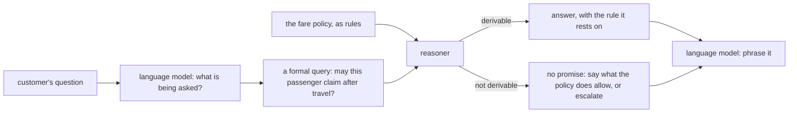

# When a chatbot makes a promise

In November 2022 Jake Moffatt's grandmother died. He went to Air Canada's website to book a flight
to the funeral and asked the airline's chatbot about bereavement fares. The chatbot told him he could
buy a regular ticket now and apply for the discounted bereavement fare **within 90 days** afterwards.

He did. Air Canada refused the refund: its bereavement policy, on another page of the same website,
did not allow claims for travel that had already happened.

He took the airline to British Columbia's Civil Resolution Tribunal. Air Canada argued, in the
tribunal's words, that the chatbot was *"a separate legal entity that is responsible for its own
actions."* The tribunal rejected that. A chatbot, it said, "is still just a part of Air Canada's
website", and the airline is responsible for all the information on its website. It found
**negligent misrepresentation** and ordered Air Canada to pay CA$650.88 in damages, plus interest and
fees: CA$812.02 in all (*Moffatt v. Air Canada*, 2024 BCCRT 149, February 2024).

The sum is small. The principle isn't: **what a company's AI says, the company says.** This page is
about why that happened, why a better prompt doesn't fix it, and what kind of system would have
answered correctly.

---

## What went wrong, read as meaning rather than text

To a language model the reply was a fluent, relevant, polite paragraph. To the law, and to logic, it
was something much more specific.

| layer | what the chatbot's answer actually was |
|---|---|
| **grammar** | a sentence about a fare |
| **meaning** | a **permission**: *you may claim the bereavement fare after travelling, within 90 days* |
| **source** | a permission can only come from the airline's policy, so the answer is a claim about that policy |
| **status** | the policy did **not** grant that permission, so the answer was false |
| **consequence** | the customer **believed** it, reasonably, and acted on it |

Every row is a modal notion from [the modal systems page](modal-systems.md):

- *May claim* is **deontic**: a permission.
- *Within 90 days, after travel* is **temporal**.
- *The customer believed it* is **doxastic**: a belief, which can be false.
- *The airline should have known its own policy* is **epistemic**: knowledge, which cannot be false.

The system that produced the answer had no representation of **any** of these. It had no idea it
was granting a permission, no link from that permission to the policy that governs permissions, and
no way to notice that the customer's resulting belief was false. It produced the most plausible
continuation of the conversation, and a plausible continuation is not a checked commitment.

---

## Why a better model or a better prompt does not fix it

A language model generates text one token at a time, each chosen by probability given the text so
far. That is what makes it fluent, and it is also why:

- **Plausible and true are different targets.** A retroactive refund window *sounds* like a perfectly
  reasonable policy. Nothing in token prediction distinguishes *a policy an airline might have* from
  *the policy this airline has*.
- **Retrieval narrows the gap without closing it.** Pasting the policy into the prompt
  (retrieval-augmented generation) makes the right text *available*. The model still paraphrases it,
  and a paraphrase can drop the one clause that matters: *not for completed travel*.
- **Reasoning in text is still text.** Asking the model to "think step by step" produces steps that
  *look* like reasoning, but nothing checks that each step follows from the last, or from the policy.
  See [Neuro-symbolic AI](neuro-symbolic.md).
- **There is nothing to audit.** After the fact, nobody can show *why* the system said it, which rule
  it relied on, or that it could not have said otherwise.

None of these is a bug in one model. They follow from generating language without a model of what
the language **commits** you to.

---

## What a system with semantics does instead

Put the policy where a machine can reason with it, and let the language model do what it is good
at: reading the customer and phrasing the answer.



The policy becomes a small theory, the same shape as [`Duty.hs`](../../src/MLambda.AI.Minds/Duty.hs).
Here is a sketch of that shape, not yet a sample in the build:

```
law bereavementFare = ∀ p t, passenger(p) ∧ bereaved(p) ∧ booked(p, t) ∧ ¬ travelled(t)
                             ⇒ permitted(p, claim_bereavement(t))
query may_claim(who: Person, trip: Trip) :- permitted(who, claim_bereavement(trip))
```

Now the conversation goes differently:

1. The language model turns *"can I get the bereavement rate after I fly?"* into the question
   `may_claim(jake, trip)` **after** `travelled(trip)`.
2. The reasoner finds no rule that permits it, because the only rule requires `¬ travelled`.
3. The system **cannot** promise the refund. It has no derivation to hang the promise on. It can say
   what the policy *does* permit, book the reduced fare now, or hand over to a person.
4. If a promise is made, it comes with its **grounds**: the rule and the facts. That record is what
   an auditor, or a tribunal, would ask for.

The language model can still be wrong about what the customer asked, but that error is now visible
(the formal query is on record) and it can't turn into an invented permission.

---

## The kinds of problem semantics solves

"Making a computer understand semantics" sounds abstract. In practice it means one thing: **the
system represents what its statements mean, so it can check them before it acts on them.** That pays
off wherever a wrong statement has a cost.

| kind of problem | what the semantics represents | what goes wrong without it |
|---|---|---|
| **Entitlements and eligibility**: refunds, benefits, insurance claims, grants | permissions and obligations with conditions | an invented entitlement the organisation must honour, as with Air Canada |
| **Compliance and regulation**: consent, data retention, anti-money-laundering, safety rules | what is forbidden, required, and by when | a system that is fluent about the regulation and violates it |
| **Contracts and deadlines**: SLAs, payment terms, notice periods | obligations over time, fulfilment, breach | a due payment treated as a paid one, a missed deadline nobody flags |
| **Clinical guidelines**: dosing, contraindications, follow-up | rules plus what is known about this patient | a recommendation that contradicts a recorded allergy |
| **Access control and privacy** | who may know what, and who already knows | an assistant that reveals data to someone not entitled to it |
| **Autonomous action**: robots, trading, agents with tools | what the agent believes, intends and is forbidden to do | an action taken on a false belief, or outside its permissions |
| **Coordination between parties** | who knows what, and what is common knowledge | two systems each assuming the other has been told |
| **Consistency of rulebooks** | all the rules at once | two policies that oblige and forbid the same act, discovered by a customer |
| **Explanation and audit** | the derivation behind each conclusion | "the AI said so", which a tribunal has now said is not a defence |

The common thread is **accountability**: in each case somebody will eventually ask *on what grounds?*
A system with semantics has an answer. A system with only fluent text doesn't.

---

## What semantics alone does not solve

It would be dishonest to stop there.

- **It doesn't read people.** Customers don't speak in queries. Turning *"my nan passed, can I still
  get the cheap fare after the funeral?"* into `may_claim(jake, trip)` is language understanding, and
  it's what neural models are good at.
- **It's only as good as its rules.** If the policy is written down wrong, the reasoner will faithfully
  apply the wrong policy. The gain is that the error is *in one place, readable*, rather than
  scattered through a model's weights.
- **It can't see.** Images, speech and sensor readings need perception first.

So the winning design is not "logic instead of neural networks". It is **neural networks that
propose, and logic that decides what may be committed to**. That combination has a name, and some
very public successes: [Neuro-symbolic AI](neuro-symbolic.md).

---

**Sources.** *Moffatt v. Air Canada*, 2024 BCCRT 149 ([CanLII](https://www.canlii.org/en/bc/bccrt/doc/2024/2024bccrt149/2024bccrt149.html)).
American Bar Association, "BC Tribunal Confirms Companies Remain Liable for Information Provided by AI
Chatbot" (February 2024). McCarthy Tétrault, "Moffatt v. Air Canada: A Misrepresentation by an AI
Chatbot" (2024).
